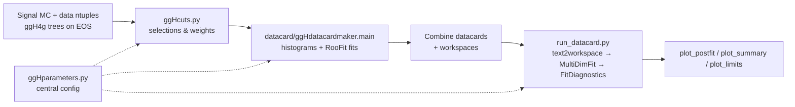

# ggHStat — H → φφ → 4γ statistical analysis

Tools for the statistical analysis of a Beyond-the-Standard-Model search for
**displaced photons from the Higgs boson**: `gg → H → φφ → 4γ`, using CMS
Run‑2 and Run‑3 data.

The Higgs decays to a pair of light scalars `φ`, each of which decays to two
photons. Because the `φ` can be long‑lived, the photons are **displaced** — the
search is parametrized in both the scalar mass `m_φ` and its lifetime `cτ`.
This repository builds the signal/background models, writes
[Combine](https://cms-analysis.github.io/HiggsAnalysis-CombinedLimit/)
datacards, runs the fits, and produces every plot in the analysis.

---

## Analysis at a glance

- **Signal:** `H → φφ → 4γ`, scanned over `m_φ ∈ {15, 20, 30, 40, 50, 55} GeV`
  and `cτ ∈ {0, 10, 20, 50, 100, 1000} mm`.
- **Observable:** the reconstructed, vertex‑corrected 4γ mass
  `best_4g_corr_mass`, fit in the window **110–140 GeV** (60 bins).
- **Categories** (by the transverse decay length of the two `φ` candidates,
  threshold `lxy = 50 cm`):
  - `prompt`   — both `φ` prompt
  - `asym`     — one prompt, one displaced
  - `displaced`— both displaced
- **Background:** data‑driven, modeled with a Bernstein polynomial fit to the
  mass sidebands; signal modeled with a double‑sided Crystal Ball.
- **Blinding:** the signal window is blinded in data; the background shape comes
  from preselected 4γ data normalized to the fully‑ID'd sidebands.
- **Eras:** Run‑2 `{2017, 2018}` and Run‑3
  `{2022preEE, 2022postEE, 2023preBPix, 2023postBPix, 2024}`.
  *(2016 is no longer used — the trigger is too inefficient.)*

---

## Requirements

This package runs inside a CMSSW area (developed in `CMSSW_14_1_0_pre4`) with the
Combine tool installed:

- [`HiggsAnalysis-CombinedLimit`](https://cms-analysis.github.io/HiggsAnalysis-CombinedLimit/)
  (`combine`, `combineCards.py`, `text2workspace.py` on `$PATH`)
- ROOT / PyROOT
- Python: `numpy`, `scipy`, `uproot`, `awkward`, `matplotlib`

Set up the environment before running anything:

```bash
cmsenv
```

All commands below are run **from this directory** (the package root), so that
`ggHparameters`, `ggHcuts`, `datacard/`, and `plotting/` resolve as imports.

---

## Repository layout

```
.
├── ggHparameters.py        # central configuration: fit orders, binning, lumi,
│                           #   cross sections, systematics, fit-shape params
├── ggHcuts.py              # selection strings (trigger, ID, preselection,
│                           #   category & blinding cuts, MC event weight)
│
├── run_datacard.py         # ENTRY POINT: build cards → run Combine → postfit plots
├── run_summary.py          # ENTRY POINT: produce summary plots over all points
├── UL_vs_mass.py           # mass/lifetime scan of expected upper limits
│
├── datacard/               # datacard & workspace construction
│   ├── ggHdatacardmaker.py #   main(): orchestrates histos + fits + card writing
│   ├── datacardtools.py    #   histogram building, data hist, Clopper–Pearson
│   ├── ggHfitter.py        #   RooFit fitting (Bernstein bkg, DCB signal, S+B)
│   └── ggHdatacardworkspace.py  # DatacardWorkspace: assembles the Combine card
│
└── plotting/               # all plotters + plotting infrastructure
    ├── ggHcmsstyle.py      #   CMSstyle() wrapper
    ├── CMS_lumi.py         #   official CMS_lumi helper
    ├── tdrstyle.py         #   official TDR style
    ├── plottingtools.py    #   Poisson errors, histo I/O helpers
    ├── plot_summary.py     #   S+B summary plot (per mass/ctau/year)
    ├── plot_blinded_sidebands.py  # blinded ID vs. preselected sidebands
    ├── plot_postfit.py     #   pre/post-fit plots from Combine outputs
    ├── plot_limits.py      #   1D / 2D limit plots
    ├── plot_optimization.py#   category-boundary optimization scan
    ├── plot_lxy.py         #   2D L_xy heatmap
    └── plot_comparison.py  #   ggH vs. VH cross-section comparison
```

---

## The pipeline



1. **Configure** — all knobs live in `ggHparameters.py`; all selection strings
   live in `ggHcuts.py`.
2. **Build the model** — `datacard/ggHdatacardmaker.main()` fills the signal and
   background histograms, fits the signal (double Crystal Ball) and background
   (Bernstein), and writes one Combine datacard + workspace per category.
3. **Fit** — `run_datacard.py` converts each card with `text2workspace.py`,
   runs `MultiDimFit` and `FitDiagnostics`, and combines the per‑category cards.
4. **Plot** — postfit and summary plots are produced from the Combine outputs.

---

## Usage

### 1. Build datacards & run the fit — `run_datacard.py`

**Single mass/lifetime/era**, choosing up to four categories
(`-c1 … -c4`, each one of `prompt | asym | displaced | all`):

```bash
python3 run_datacard.py \
    -s /path/to/signal_ggH4g.root \
    -b /path/to/data_EGamma.root \
    -m 30 -ct 100 -y 2018 \
    -c1 prompt -c2 asym -c3 displaced
```

This builds each category card, runs Combine, makes the postfit plots, and (with
2+ categories) combines the cards into
`datacard_ggH_4g_m30_ct100_combined_2018.txt`.

**Process an entire run** (loops all configured mass/lifetime/era points and
combines cards automatically — signal/background paths are templated inside the
script):

```bash
python3 run_datacard.py -process_run2 1   # 2017, 2018
python3 run_datacard.py -process_run3 1   # 2022–2024
```

### 2. Summary plots — `run_summary.py`

Loops over all mass / lifetime / year points and writes a signal+background
summary plot for each:

```bash
python3 run_summary.py
```

### 3. Expected-limit scan — `UL_vs_mass.py`

Scans `(mass, lifetime, year)`, building cards, running
`AsymptoticLimits`, and collecting the median expected upper limit on `r`.
Edit the point lists at the bottom of the file, then:

```bash
python3 UL_vs_mass.py
```

### 4. Individual plotters

The plotters under `plotting/` import the package, so run them as **modules**
from this directory:

| Command | Produces |
| --- | --- |
| `python3 -m plotting.plot_summary -m 30 -ct 100 -y 2018` | S+B summary plot |
| `python3 -m plotting.plot_blinded_sidebands -m 30 -ct 100 -y 2018` | blinded sideband comparison |
| `python3 -m plotting.plot_limits` | 1D limit plot (`plot_2D()` for the heatmap) |
| `python3 -m plotting.plot_optimization` | category-boundary optimization scan |
| `python3 -m plotting.plot_lxy` | 2D `L_xy` heatmap |
| `python3 -m plotting.plot_comparison` | ggH vs. VH cross-section comparison |

`plot_postfit.plot(...)` is normally driven by `run_datacard.py` rather than run
standalone.

---

## Configuration reference

Key settings in **`ggHparameters.py`**:

| Setting | Meaning |
| --- | --- |
| `signal_window`, `n_bins`, `bins` | fit window (110–140 GeV) and binning (60 bins) |
| `order_fit`, `order_gen` | Bernstein background polynomial orders |
| `lxy1`, `lxy2` | category `L_xy` thresholds (cm) |
| `signal_xsec`, `BR` | ggH+VBF cross section (pb) and assumed `BR` |
| `lumi`, `lumi_unc` | per-era integrated luminosity (pb⁻¹) and uncertainty |
| `bkg_scale_factor`, `bkg_factor` | data-driven background normalization (per era) |
| `xsec_unc`, `pdf_alphas_unc` | theory systematics (ggH, VBF) |
| `dcb_*`, `bernstein_coeff*` | signal (double Crystal Ball) and background fit-shape parameters |

Selection strings in **`ggHcuts.py`** (`trigger`, `preselection`, `full_id`,
`dxy_valid`, `pileup`, `categories`, `blind`, `mc_weight`) are composed with
`cuts.combine(...)` and shared by the datacard maker and the plotters so the
event selection is defined in exactly one place.

---

## Conventions

- **Datacards:** `datacard_{physics}_{finalstate}_m{mass}_ct{lifetime}_{cat}_{year}.txt`
  (combined cards use `_combined_` in place of the category).
- **Rate histograms:** `rate_histos_m{mass}_ct{lifetime}_{cat}_{year}.root`.
- **Generated outputs** (`*.root`, `*.png`, `*.pdf`, `*.txt`, `*.json`, `*.out`)
  are git-ignored — only source is tracked.

---

## Caveats

- The Bernstein background fit can silently converge to a degenerate solution
  when the sidebands are sparse — check the sideband statistics before trusting a
  fit result.
- 2016 is intentionally excluded (trigger inefficiency).
